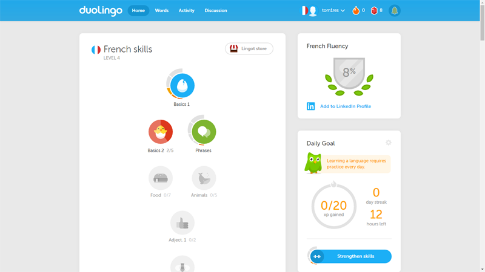
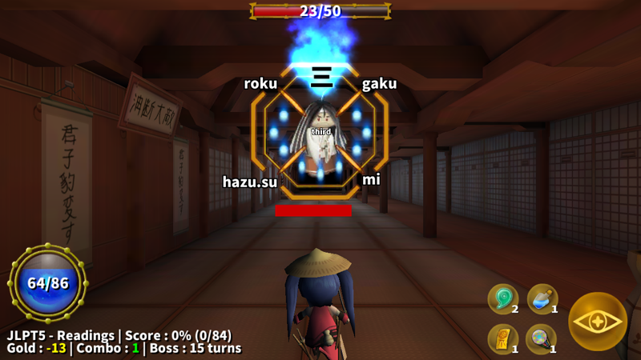
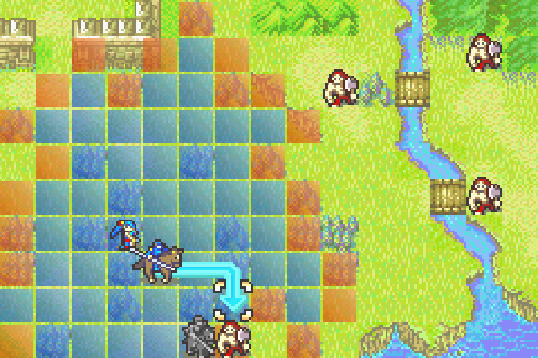

# Existing products

In this chapter we will introduce some of the many examples of non-gaming educational applications as well as a couple educational videogames that we draw expertise from when designing the educational element of our videogame. Also mentioned are examples of the role-playing game genre that include turn-based combat. We conclude the chapter by selecting features that would form the basis for our game.

## Non-gaming applications

There is currently an abundance of non-gaming applications available on the market that utilize spaced repetition for learning purposes. The most popular examples are Anki, Memrise, Duolingo and Wanikani, just to name a few. Apart from Anki, which is a lightweight application with a do-it-yourself approach, all of these applications include a gamification element, which gratifies the learner by providing virtual badges, leaderboards and progress indicators. These functions are geared towards stimulating competitiveness, a basic human trait, which in turn keeps the player coming back for more.

### Memrise

#### Learning element

Content in Memrise is divided into languages, which are further divided into courses made and maintained by end users. Learner can associate a course with their account and be notified each day when it is time to practice. This mechanism helps maintain knowledge. Users interact with the learning system in the following ways:

* learning mode - the session consists of repeated queries on a number of new phrases,
* review mode - player is given a set of queries on phrases that have not been practiced lately,
* speed review - introduces stricter time constraints,
* my difficult words - the session consists of queries on phrases that the player struggles with.

As we can see, the system includes two primary modes of repetition - one that selects phrases depending on time passed since last review and one that selects phrases that have been entered incorrectly a large amount of times.

#### Gamification

Memrise places emphasis on community features. The user can browse through profiles of other individuals, check on courses they have started, view custom-made educational memes that they have created and see a tally of words they have learned and points they have amassed.

Points are also prominently visible in leaderboards, which are displayed on course pages. The aforementioned features introduce competitiveness between players.

Another gamification feature used is called "Streak Clock", which grants the player additional points and badges for their profile for learning a specified amount of new words every day. This motivates the player to play regularly, which is of upmost importance in educational applications of this type.

### Duolingo

#### Learning element

In contrast with Memrise, Duolingo offers a unified learning experience for each language. Courses place a significant emphasis on grammar and are divided into sections, which are further divided into lessons. Progress through sections is strictly linear. In order to unlock the next section, the user has to first complete a set number of lessons and pass a revision test.

In addition to the learning experience, there is also a review mode, which works the same as in Memrise's case.

#### Gamification

Duolingo includes most if not all gamification elements of Memrise. A "Daily Goal" system is present and rewards users with "lingots", a form of virtual currency that unlocks additional challenges. Community features are for most part limited to user's friends, the system includes an activity feed that highlights user progression and is viewable by others.

### Wanikani

#### Learning element

The user interface of Wanikani is rather different from the previous two examples. The learning experience consists of learning radicals (building blocks of kanji characters), utilising said radicals in kanji and ultimately combining kanji characters into vocabulary. Although the idea of building blocks appears solid, the application feels more like an encyclopaedia rather than a learning program and the testing functions look spartan compared to the aforementioned examples and feel like an afterthought.

#### Gamification

As with Memrise and Duolingo, Wanikani includes a profile system, which shows user's progression through various stages (Apprentice, Guru, Master and so on) and includes few other basic statistics. Compared to other learning systems, Wanikani's gamification elements are very basic.

## Gaming applications

The realm of gaming applications that are focused on teaching Japanese is comparatively small. It is very important to distinguish between true gaming experiences and simple mechanics borrowed from the gaming industry. For example, there is a number of "games", whose sole gaming mechanic is the concept of hit points with no further interactivity other than selecting answers to queries. For the purpose of this thesis, we will not classify these applications as games, but rather as non-gaming applications with a gamification element. We have selected three examples that can be thought of as videogames in their own rights.

### Fude Samurai

#### Learning element

In order to execute special attacks, the player has to draw a kanji character with a correct stroke order. The player also encounters small mini games along the way which include tasks such as putting kanji characters representing numbers in correct numerical order. The queries get progressively harder the longer the player practices the kanji in question. In the first phase, they are guided by outlines of the character, afterwards they have to make do with stroke order. In the final phase, the game gives them a blank slate. The training mode which can be accessed via the main menu allows the player to practice kanji independently from their progress in the story mode.

#### Game mechanics

Fude Samurai is a one button fighter designed with mobile controls in mind. The game is relatively simple to control and rewards fast reflexes rather than strategy.

### Kanji no Owari

#### Learning element

At set intervals throughout the level, the player is presented with a review screen that highlights on'yomi and kun'yomi readings for a set number of kanji characters. These kanji characters then appear in queries that the player must answer in order to defeat incoming waves of enemies. It appears that every level includes a predetermined set of kanji for the player to practise.

#### Game mechanics

According to the developers, Kanji no Owari is a role-playing game. While it includes certain elements typical for RPG games, such as variable (and upgradeable) statistics, the effect on gameplay is rather insignificant. Players amass virtual currency through play, which they can use to buy items that help them progress through levels, for example a vial that replenishes health. Gameplay revolves around defeating monsters by answering quickly to queries. At the end of each level, the player faces a boss enemy, which differs from other kinds of enemies by possessing a large amount of health points, therefore increasing the number of queries generated.

### Learn Japanese To Survive! Hiragana Battle

#### Learning elements

Unlike the rest of the games mentioned, the player is taught hiragana instead of kanji. Players are taught new syllables in sets of five during dialogues with NPCs. They are also shown the pronunciation, draw order, albeit in a non-interactive fashion. Immediately afterwards, they are tested on the newly gained knowledge via a series of queries. Hiragana characters appear in battles as enemies. The player is required to enter correct transcription in Latin script for each character to have a chance at inflicting damage using weapons or spells. The game also includes a quest system, which teaches the player a small amount of vocabulary and factual information about Japan.

#### Game mechanics

The game is similar in play style to earlier entries in the Final Fantasy series. Players conduct turn-based battles in a traditional JRPG style. Battles take place at random intervals throughout the exploration experience, a mechanic often referred to in the gaming circles as a "random encounter".

## Turn-based role playing games

The following two examples have been chosen to illustrate different approaches to a turn-based RPG, the variations of which are used in virtually every game in the genre. The first example allows for one action per turn (per character), while the second lets the player take multiple actions over the course of a turn.

### Fire Emblem

The game features a battle system that alternates between the player and the AI. Both sides possess control over multiple characters and as such can move and execute actions with each individual character. The routine is as follows - player first moves the character to a new location and then has the option to either do nothing, attack using a weapon, use a spell or utilise an item. After performing an action, the character is deactivated for the rest of the turn. Attacks do not feature any kind of randomness, damage value is strictly determined by statistics of each character. These statistics are improved when the character levels up, the stat distribution is pre-determined to the best of my knowledge. When performing an offensive action, the target has a chance to execute a counter-attack. This depends on the character type. Melee characters cannot counter ranged attacks and characters that have received a fatal blow aren't given a chance to fight back.

### Dofus

This massively multiplayer online role-playing game contains a world populated by other players. As such, many elements of the battle system are designed to accommodate this fact. Turns have a time limit and there is an entire category of spells used to buff friendly characters. Each player has a set amount of movement points and action points (APs) that they can utilise on each turn. Individual spells have an AP cost and some have a cooldown, which prevents them from being used in subsequent turns. Each individual player controls only one character. Although some character classes are capable of summoning friendly characters, these are controlled automatically. The game includes an in-battle challenge system, which rewards players for completing certain objectives, such as killing a certain enemy first or not losing any health throughout the fight.

## Feature selection

When it comes to picking phrases, we can either place focus on time since last revision or the number of mistakes in the last couple revisions. Due to the fact that answering queries forms an integral part of the game, we can ignore the time vector as the player has to answer queries in order to progress in the game. If they stop, so does the game's progression.

One thing that we would like to borrow from Wanikani is the encyclopaedic feel. The game should include an interface that lists kanji that the player has unlocked and phrases associated with said kanji.

All three non-gaming applications place great deal of attention to gamification elements which stimulate the player. We would like to introduce online profiles in one of the expansions to the game.

When it comes to gaming applications mentioned, we cannot draw from their game design as they come from different videogame genres. We can however take note of mechanics they use to introduce new kanji to the player. Fude Samurai's story mode introduces new kanji gradually by guiding the player through stroke order. As the game places emphasis on teaching the player how to draw kanji characters, it does not need to explain pronunciation in much detail. If the player gets lost, they can practice in the training mode.

Kanji no Owari seems to be lacking in the learning department. The whole experience seems to be geared towards players familiar with kanji who only need a quick revision. Hiragana Battle seems to include the best learning experience out of the three games mentioned. Thanks to the link with NPCs and story, the learning progression is gradual and does not feel forced.

Lastly, we need to choose between the two approaches to turn-based role-playing games. As we only control one character, the mechanics used in Dofus seem to be a better fit for our game. The query mechanism needs to be linked to a frequently used gameplay mechanic. The most frequently used action in Dofus seems to be spell casting. Thanks to the ability to cast multiple spells per turn, the frequency of queries is higher than it would be if we opted to use Fire Emblem's approach.

Two other mechanics in Dofus that we would like to use are the in-battle challenge system and idols, which are items used to modify battle conditions to make them more challenging for seasoned players in exchange for additional rewards. We would like to utilise this feature in our equipment system.
