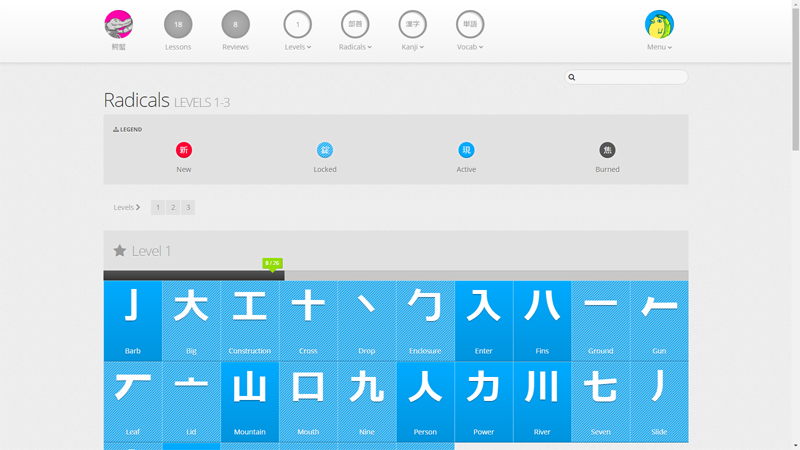

# Existing products

In this chapter I will introduce some of the many examples of non-gaming educational applications as well as a couple educational videogames that I draw expertise from when designing the educational element of my videogame. Also mentioned are examples of the role-playing game genre that include turn-based combat.

## Non-gaming applications

There is currently an abundance of non-gaming applications available on the market that utilize spaced repetition for learning purposes. The most popular examples are Anki, Memrise, Duolingo and Wanikani, just to name a few. With the exception of Anki, which is a lightweight application with a do-it-yourself approach, all of these applications include a gamification element, which gratifies the learner by providing virtual badges, leaderboards and progress indicators. These functions are geared towards stimulating competitiveness, a basic human trait, which in turn keeps the player coming back for more.

### Memrise

#### Learning element

Content in Memrise is divided into languages, which are further divided into courses made and maintained by end users. Learner can associate a course with their account and be nagged at a specific time during each day to practice. This mechanism helps maintain knowledge. Users interact with the learning system in the following ways:

* **Learning mode** - the session consists of repeated queries on a number of new phrases
* **Review mode** - player is given a set of queries on phrases that have not been practiced lately
	* **Speed Review** - introduces stricter time constraints
	* **My Difficult Words** - the session consists of queries on phrases that the player struggles with

As we can see, the system includes two primary modes of repetition - one that selects phrases depending on time passed since last review and one that selects phrases that have been entered incorrectly a large amount of times.

#### Gamification

Memrise places emphasis on community features. The user can browse through profiles of other individuals, check on courses they have started, view *mems* that they have created and see a tally of words they have learned and points they have amassed.

Points are also prominently visible in leaderboards, which are displayed on course pages. The aforementioned features introduce competitiveness between players.

Another gamification feature used is called *Streak Clock*, which grants the player additional points and badges for their profile for learning a specified amount of new words every day. This motivates the player to play regularly, which is of upmost importance in educational applications of this type.

### Duolingo

#### Learning element

In contrast with Memrise, Duolingo offers a unified learning experience for each language. Courses place a significant emphasis on grammar and are divided into sections, which are further divided into lessons. Progress through sections is strictly linear, in order to unlock the next section, user has to first complete a set number of lessons and pass a test.

In addition to the learning experience, there is also a review mode, which works exactly the same as in Memrise's case.

#### Gamification

Duolingo includes most if not all gamification elements of Memrise. A *Daily Goal* system is present and rewards users with *lingots*, a form of virtual currency that unlocks additional challenges. Community features are for most part limited to user's friends, the system includes an activity feed that highlights user progression and is viewable by others.

### Wanikani

#### Learning element

The user interface of Wanikani is rather different from the previous two examples. The learning experience consists of learning radicals (building blocks of kanji characters), utilising said radicals in kanji and ultimately combining kanji characters into vocabulary. Although the idea of building blocks appears solid, the application feels more like an encyclopaedia rather than a learning program and the testing functions look spartan compared to aforementioned examples and feel like an afterthought.

#### Gamification

As with Memrise and Duolingo, Wanikani includes a profile system, which shows user's progression through various stages (Apprentice, Guru, Master, ...) and includes few other basic statistics. Compared to other learning systems, Wanikani's gamification elements are very basic.

## Gaming applications

### Fude Samurai

#### Learning element

In order to execute special attacks, the player has to draw a kanji character with a correct stroke order. The player also encounters small mini games along the way which include tasks such as putting kanji characters representing numbers in correct numerical order. The queries get progressively harder the longer the player practices the kanji in question. In the first phase, they are guided by outlines of the character, afterwards they have to make do with stroke order. In the final phase, the game gives them a blank slate. The training mode which can be accessed via the main menu allows the player to practice kanji independently from their progress in the story mode.

#### Game mechanics

Fude Samurai is a one button fighter designed with mobile controls in mind. The game is relatively simple to control and rewards fast reflexes rather than strategy.

### Kanji no Owari

#### Learning element

At set intervals throughout the level, the player is presented with ar review screen that highlights onyomi and kunyomi readings for a set amount of kanji characters. These kanji characters then appear in queries that the player must answer in order to defeat incoming waves of enemies. It appears that every level includes a predetermined set of kanji for the player to practice.

#### Game mechanics

According to the developers, Kanji no Owari is a role-playing game. While it includes certain elements typical for RPG games, such as variable (and upgradable) statistics, the effect on gameplay is rather insignificant. Player amasses virtual currency through play, which they can use to buy items that help them progress through levels, for example a vial that replenishes health. Gameplay revolves around defeating monsters by answering quickly to queries. At the end of each level, the player faces a boss enemy, which differs from other kinds of enemies by posessing a large amount of hitpoints, therefore increasing the amount of queries generated.

[//]: <> (Memrise - vocabulary)
[//]: <> (Duolingo - grammar)
[//]: <> (Wanikani - kanji)