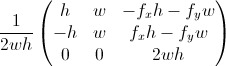

# Battle System

## Introduction

The following section details choices made regarding key design elements included within the battle system and the motivations behind those choices.

### Battle flow

In the chapter concerning existing products, I have detailed two common approaches used within the turn-based RPG genre. In Fire Emblem and similar JRPGs, in each turn the player moves a character and then performs a single action, be it using an item, casting a spell or staying still. I feel this approach works best in games that introduce player control over multiple characters. In games with a single controllable character, this approach feels too simplistic and furthermore limits the learning element of the game.

The other mainstream approach is to allow the player to move and cast spells freely during each turn. Utilizing this design choice, each spell in the game is given a mana cost that depends on spell's power. A mana pool of certain size is refilled at the beginning of each turn and allows the player to cast multiple spells. Correspondingly the player is allocated a certain number of movement points that they can utilize during each turn.

### Learning element

Each spell has a kanji difficulty setting associated with it that controls which set of phrases is chosen. As with the mana cost, more powerful spells trigger a choice of more complex kanji phrases.

During the process of choosing phrases for the game, I have decided to divide these into two sets. The first contains kun'yomi readings of characters and therefore includes mostly verbs. The second contains on'yomi readings, which are typically present in kanji compounds.

After casting a spell, the player is presented with a query containing a kanji character and they are required to type a correct kana transcription. Each spell has a set base damage, which decreases depending on the time it takes to answer the query.

### Challenge system

The challenge system introduces a set of voluntary battle-specific goals that are meant to incentivize certain styles of play in order to alleviate repetition.

## Architecture


### Data structures

The following section includes details on structures of persistent files used throughout the battle part of the game. With the sole exception of map files, all files are in human-readable JSON format.

#### Map

Maps are stored in a Lua script file. Tiled export formats also include JSON and CSV, however the choice of a Lua file including a table definition is preferable as it allows the load routine to skip deserialization, which can be advantageous when using larger map files. For a brief summary of contents, please refer to the Technology section of this thesis. As of version 0.17 Tiled also supports Defold's native tile format, however the current implementation only allows for orthogonal maps and is therefore unsuitable for my game.

The game uses four map layers to store data:

1. large_object - contains sprites spanning multiple tiles (e.g. trees)
2. object - contains smaller obstacles such as rocks or tile decorations
3. logic - used by the battle logic script to determine whether a cell is accessible
4. terrain - contains base tiles

#### Dictionary

The file includes two arrays. The first array is used for less powerful spells and includes individual characters, which exclusively use kun'yomi readings, the second includes more complex composite characters used for more powerful spells, typically using on'yomi readings. Each entry includes a kanji character, its kana transcription and an English translation.

```JSON
[

[{"kanji": "日", "kana": "ひ", "meaning": "day"},
{"kanji": "人", "kana": "ひと", "meaning": "person"},
...
],

[
{"kanji": "銀行", "kana": "ぎんこう", "meaning": "bank"},
{"kanji": "小説", "kana": "しょうせつ", "meaning": "novel"}
...
]

]
```

#### Spellbook

The file includes an array of spells used in the game. Each spell has a name, mana cost and a difficulty which corresponds to each of the arrays in dictionary and accept values of either 1 or 2. Spells have a base damage, which decreases with time used up by player to answer the query, minimal and maximal range in cells indicating distance from player character.

Damage range can either be set to 1 which inflicts damage only on the selected cell or a larger integer, which also affects a corresponding number of surrounding cells - an effect often referred to in video game design as an Area of Effect (AoE) spell. The Linear AoE attribute can be set to 1 to make the spell affect targets behind the selected cell (from player character's point of view), 2 to inflict damage to targets in-between the player character and selected cell or 0 to use the more traditional planar AoE.

```JSON
[

{
  "name": "Whirl",
  "cost": 2,
  "kanji_difficulty": 1,
  "base_damage": 45,
  "min_range": 1,
  "max_range": 1,
  "damage_range": 1,
  "linear_aoe": 0
},
...
]
```
#### Enemy

The file includes information about all enemies in the game. Each enemy entry contains a type definition used internally within the game, name displayed as part of battle GUI, initial health value, number of moves, base damage and attack range.

```JSON
[

{
  "type": "big_bunny",
  "name": "Big Bunny",
  "health": 60,
  "movement_pool": 3,
  "attack": 6,
  "range": 1
},
...
]
```

### Script entities

The following section contains information about script entities used within the battle part of the game.

#### Battle Logic

Controls the flow of a battle. Structures included within control movement, actions and statistics of both the player character and any enemies present on the map. A-star algorithm is used to find the shortest paths for enemies to follow. Validity of cells in regards to movement and/or casting is determined from the map's logic layer.

#### Battle GUI

Updates information present on the game's user interface. The script also manages all keyboard and mouse/touch input from the player when a battle is ongoing.

#### Dictionary

This script is utilized during the process of casting a spell. It chooses a kanji with the lowest success rate from the dictionary data structure to use during a query. After completion of the query, it saves the result to a save file.

#### Kana Parser

Works in conjunction with Battle GUI to translate latin characters written by the player into hiragana. The parser adheres to rules defined by Hepburn romanization system, the most widely used transcription method. The solution for more complex cases, such as the insertion of sokuon characters is inspired by the behaviour of Microsoft Input Method Editor for Japanese.

**ADD STATE AUTOMATA?**

#### Challenges

Picks two random entries from the list of available challenges and afterwards keeps track of their status (in progress, successfully completed, failed). Due to the need to incorporate hooks into other scripts, the challenge list is hardcoded and therefore doesn't depend on an external data structure.

#### Spell

Determines valid targets during the spell casting process based on information present in the spellbook data structure and logic layer of the current map. Also calculates damage based on time taken by the player to answer a query and base damage of the selected spell.

#### Map

Renders terrain tiles, objects and characters in a correct order based on information included within the map data structure as well as parameters passed from outside scripts.

The script also handles conversion between input coordinates and the game's coordinate system. Map coordinates are calculated using the following transformation matrix.



#### Camera

Moves the camera game object in a smooth fashion.

**INTERPOLATION DETAILS**
