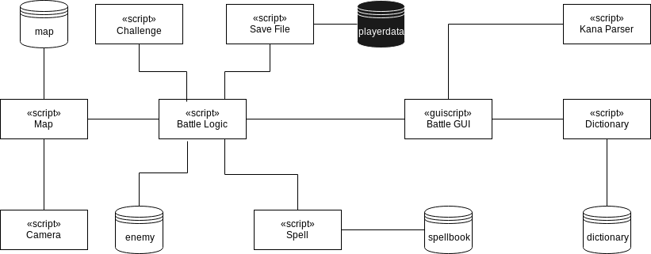

# Battle system


This chapter includes description of combat mechanics, the learning and the challenge systems used in the game, a diagram detailing communication between components and a detailed description of these components and data structures exclusive to the battle portion of the game.

## Introduction

The following section details choices made regarding key design elements included within the battle system and the motivations behind these choices.

### Battle flow

In the chapter concerning existing products, we have detailed two common approaches used within the turn-based RPG genre. In Fire Emblem and similar JRPGs, during each turn the player moves a character and then performs a single action, be it using an item, casting a spell or staying still. This approach seems to work best in games that introduce player control over multiple characters. In games with a single controllable character, this approach feels too simplistic and furthermore limits the potential of the game's learning element.

The other mainstream approach is to allow the player to move and cast spells freely during each turn. Utilising this design choice, each spell in the game is given a mana cost that depends on power of the spell. A mana pool of certain size is refilled at the beginning of each turn and allows the player to cast multiple spells. Correspondingly the player is allocated a certain number of movement points that they can utilise during each turn.

### Learning element

Each spell has a kanji difficulty setting associated with it that controls which set of phrases is chosen. More powerful spells trigger a choice between more complex kanji phrases.

During the process of choosing phrases for the game, I have decided to divide them into two sets. The first contains kun'yomi readings of characters and therefore includes mostly verbs. The second contains on'yomi readings, which are typically present in kanji compounds. The choice of kanji depends on player character's level and their previous actions. The system prioritizes kanji with high error rates.

After casting a spell, the player is presented with a query containing a kanji character and they are required to type a correct kana transcription. Each spell has a set base damage, which decreases depending on the time it takes to answer the query. We originally planned on introducing an element of randomness to the amount of damage given, but doing so would negate the effects of the educational element.

### Challenge system

The challenge system introduces a set of voluntary battle-specific goals that are meant to incentivise certain styles of play in order to alleviate repetition. In contrast with quests, these goals deal exclusively with battle mechanics. Certain challenges are easier than others in order to accommodate skill levels of all players. The implemented examples are as following:

- Kill an enemy before switching targets.
- Use a spell at most once a turn.
- Finish in 10 turns.
- Finish without taking any damage.
- Do not fail a single query.
- Do not move during entire fight.

Each challenge is assigned modifiers, which increase the amount of experience and currency gained on conclusion of the fight should the challenge be successfully completed.

## Architecture



### Data structures

The following section includes details on structures of files used throughout the battle part of the game. All files are in human-readable JSON format.

#### Dictionary

The file includes two arrays. The first array is used for less powerful spells and includes individual characters, which exclusively use kun'yomi readings, the second includes more complex composite characters used for more powerful spells, typically using on'yomi readings. Each entry includes a kanji character or conjugation thereof, its kana transcription and an English translation.

```JSON
[
    [
        {"kanji": "日", "kana": "ひ", "meaning": "day"},
        {"kanji": "本", "kana": "ほん", "meaning": "book"},
        {"kanji": "人", "kana": "ひと", "meaning": "person"},
        ...
    ],

    [
        {"kanji": "日本", "kana": "にほん", "meaning": "Japan"},
        {"kanji": "日本人", "kana": "にほんじん", "meaning": "Japanese person"},
        ...
    ]
]
```

#### Spellbook

The file includes an array of spells used in the game. Each spell has a name, mana cost and a difficulty which corresponds to each of the arrays in dictionary and accepts values of either 1 or 2. Spells have a base damage, which decreases with time used up by player to answer the query, and minimal and maximal ranges indicating distance from player character in number of cells.

Damage range can either be set to 1 which inflicts damage only on the selected cell or a larger integer, which also affects a corresponding number of surrounding cells - an effect often referred to in video game design as an Area of Effect (AoE) spell. The Linear AoE attribute can be set to 1 to make the spell affect targets behind the selected cell (from player character's point of view), 2 to inflict damage to targets in-between the player character and selected cell or 0 to use the more traditional planar AoE.

```JSON
[

    {
        "name": "Whirl",
        "cost": 2,
        "kanji_difficulty": 1,
        "base_damage": 45,
        "min_range": 1,
        "max_range": 1,
        "damage_range": 1,
        "linear_aoe": 0
    },
    ...
]
```

### Script entities

The following section contains information about script entities used in the battle part of the game.

#### Battle logic

Controls the flow of a battle. Structures included within control movement, actions and statistics of both the player character and any enemies present on the map. A* search algorithm is used to find the shortest paths for both the enemies and the player to follow. Validity of cells in regards to movement and casting is determined by the map's logic layer.

#### Battle GUI

Updates information present on the game's user interface. The script also manages all keyboard and mouse/touch input from the player when a battle is ongoing.

#### Dictionary

This script is utilized during the process of casting a spell. It chooses a kanji with the lowest success rate from the dictionary data structure to use during a query. After completion of the query, it saves the result to a save file.

#### Challenge

Picks two random entries from the list of available challenges and afterwards keeps track of their status (in progress, successfully completed, failed). Due to the need to incorporate hooks into other scripts, the challenge list is hard coded and therefore doesn't depend on an external data structure.

#### Spell

Determines valid targets during the spell casting process based on information present in the spellbook data structure and logic layer of the current map. Also calculates damage based on time taken by the player to answer a query and base damage of the selected spell.

#### Kana parser

Works in conjunction with battle GUI to translate Latin characters written by the player into hiragana. The parser adheres to rules defined by Hepburn romanization system, the most widely used transcription method. The solution for more complex cases, such as the insertion of sokuon characters is inspired by the behaviour of Microsoft Input Method Editor for Japanese.


:octocat: | a | i | u | e | o | ya | yu | yo
-- | - | - | - | - | - | -- | -- | --
ー | あ | い | う | え | お | や | ゆ | よ
**k** | か | き | く | け | こ | きゃ | きゅ | きょ
**s** | さ | ー | す | せ | そ | ー | ー | ー
**t** | た | ー | ー | て | と | ー | ー | ー
**n** | な | に | ぬ | ね | の | にゃ | にゅ | にょ
**h** | は | ひ | ー | へ | ほ | ひゃ | ひゅ | ひょ
**m** | ま | み | む | め | も | みゃ | みゅ | みょ
**y** | や | ー | ゆ | ー | よ | ー | ー | ー
**r** | ら | り | る | れ | ろ | りゃ | りゅ | りょ
**w** | わ | ー | ー | ー | を | ー | ー | ー
**g** | が | ぎ | ぐ | げ | ご | ぎゃ | ぎゅ | ぎょ
**z** | ざ | ー | ず | ぜ | ぞ | ー | ー | ー
**d** | だ | ー | ー | で | ど | ー | ー | ー
**b** | ば | び | ぶ | べ | ぼ | びゃ | びゅ | びょ
**p** | ぱ | ぴ | ぷ | ぺ | ぽ | ぴゃ | ぴゅ | ぴょ

Romaji | Kana | Romaji | Kana | Romaji | Kana
------ | ---- | ------ | ---- | ------ | ----
n | ん | fu | ふ | shi | し
sha | しゃ | shu | しゅ | sho | しょ
chi | ち | tsu | つ　| cha | ちゃ
chu | ちゅ | cho | ちょ　| ji | じ
ja | じゃ | ju | じゅ　| jo | じょ
