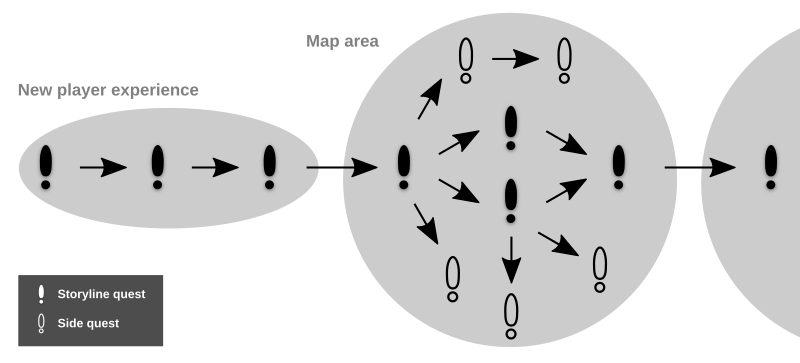

# Exploration system

## Introduction

### Questing system

The quest system is an important plot device that motivates the player and helps alleviate the negative effects of grind mechanics on player retention. While researching the possible quest archetypes, I wanted to focus on three aspects - repeatability, quests as means of motivating the player to move between game areas and variability.

#### Repeatability

The first aspect concerns quests that are meant to be experienced multiple times. Repeatable quests entice the player to return to previous areas and usually provide rewards that are exclusive to a particular region of the map they take place in.

#### Exploration quests

These quests are generally one-time only opportunities that are designed to move the player from one area to another in a smooth and believable fashion. These types of quests are utilised in World of Warcraft, where they are referred to as breadcrumb quests. I will work with branching quest arcs, however, for the sake of simplicity, no two quests can be mutually exclusive.

The following diagram illustrates the relationships between quests. Green exclamation marks symbolize main quests, while yellow marks symbolize side quests. Main quests are dependent on one another, while side quests are optional. Many main quests are of the breadcrumb type, as discussed in the previous paragraph, though this is not always the case.



#### Variability

One issue a lot of modern role-playing games face is the lack of variability when it comes to quests. The player is generally asked to kill a certain number of enemies or to collect certain items. To help combat this fact, I have listed below some examples that can be used within my game.

- Character hunting quest (triggering conversations with different NPCs)
- Scavenger hunt (locating certain cues hidden within the environment)
- Enemy killing quest (killing a number of enemies of a specific type)
- Gathering quest (collecting a number of resources from enemies or crafting nodes)
- Achievement quest (meeting a condition, such as achieving consistent success in regards to the learning element or completing a number of challenges)

### Item system

The game has three categories of items. Equipment, which the player can wear to change the behaviour of certain parts of the game, consumables that they can use in battle to increase health and potentially cause other effects, and resources, which are used for completing quests or can be further refined via crafting.

#### Equipment

Equipment in most modern role-playing games is designed to increase arbitrary player statistics. As a player, I feel this approach is rather artificial and lacking. Besides, in an educational game, focus should be given on the educational element. The proficiency of the player should be the main factor in determining their potency.

Therefore, I have designed the equipment to alter game mechanics in ways that both benefit and punish the player in certain areas, a mechanic similar to the Idol system in Dofus. For example, certain players might prefer to have more time when answering queries. They can wear an item that increases available time, but decreases damage that the spell causes. Other players could prefer the opposite, so another item will exist which decreases available time and increases damage caused, thus rewarding faster memory recall skills.

#### Consumables

Consumable items are meant to be used within the game's battle mode. They generally provide additional health points to the player and would be essential for more difficult fights. They can also provide supplementary effects such as temporary stuns, increase available movement points and more. No consumables should provide damage dealing capabilities as doing so would interfere with spells and the associated learning element. When using a consumable, the player does not have to answer a query.

#### Resources

The resources category contains items that can be used to create consumables, used in gathering quests, or do not perform any function other than generating profit for the player via the mechanic of selling the item to the vendor NPC.

### Economy

### Learning progression


## Architecture

### Data structures

#### Item

```JSON
[

  {
    "id": 1,
    "name": "Potion",
    "icon": "potion.png",
    "value": 30,
    "category": "Consumable",
    "effects": {
        "health": 60
    }
  }
...
]
```

#### Droprate

```JSON
[

  {
    "enemy_id": 1,
    "items": [
        {
            "item_id": 1,
            "probability": 0.3
        },
        {
            "item_id": 3,
            "probability": 0.7
        }
    ]
  },

...
]
```

#### NPC

```JSON
[

  {
    "id": 1,
    "name": "Old Guy",
    "vendor": 0,
    "starting_dialogue": 25
  }
...
]
```

#### Dialogue

```JSON
[

  {
    "id": 25,
    "text": "I have a favour to ask.
             My crops have been decimated by rabbits you see...",
    "next_dialogue": 26
  }
...
]
```

#### Quest

```JSON
[

  {
    "id": 5,
    "npc": 1,
    "active": true,
    "repeatable": false,
    "description": "Reclaim the land by killing the Elder Rabbit
                    and four of its friends!",
    "prerequisites": [2],
    "triggers": [["KILL_ENEMY", 2, 1], ["KILL_ENEMY", 1, 4]],
    "exp_reward": 500,
    "gold_reward": 60,
    "item_reward": [1, 1, 5],
    "set_npc_dialogue": 54
  }
...
]
```

#### Map area

```JSON
[

  {
    "id": 5,
    "name": "Rabbit Island",
    "enemy_types": [[1, 0.2], [2, 0.1]],
    "max_mob_size": 4
  }
...
]
```

### Script entities
