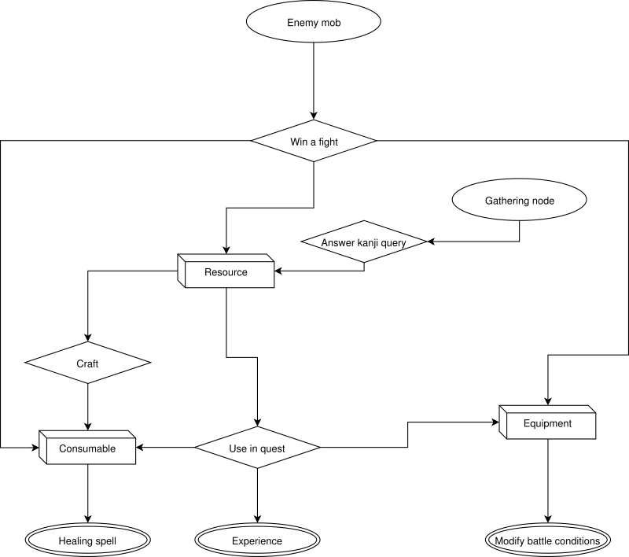
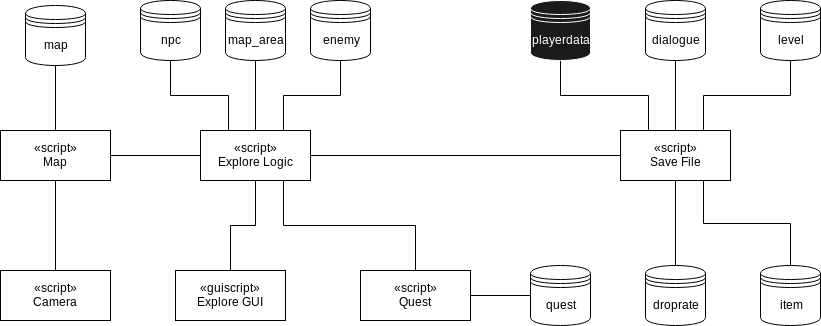

# Exploration system

## Introduction

The following section details choices made regarding key design elements included within the exploration system and the motivations behind these choices.

### Questing system

The quest system is an important plot device that motivates the player and helps alleviate the negative effects of grind mechanics on player retention. While researching the possible quest archetypes, I wanted to focus on three aspects - repeatability, quests as means of motivating the player to move between game areas and variability.

#### Repeatability

The first aspect concerns quests that are meant to be experienced multiple times. Repeatable quests entice the player to return to previous areas and usually provide rewards that are exclusive to the particular region of the map they take place in.

#### Exploration quests

These quests are generally one-time-only opportunities that are designed to move the player from one area to another in a smooth and believable fashion. These types of quests are utilised in World of Warcraft, where they are referred to as breadcrumb quests. We will work with branching quest arcs, however, for the sake of simplicity, no two quests can be mutually exclusive.

The following diagram illustrates the relationships between quests. Green exclamation marks symbolise main quests, while yellow marks symbolise side quests. Main quests are dependent on one another, while side quests are optional. Many main quests are of the breadcrumb type, as discussed in the previous paragraph, though this is not always the case.


#### Variability

One issue a lot of modern role-playing games face is the lack of variability when it comes to quests. The player is generally asked to kill a certain number of enemies or to collect certain items. To help combat this fact, I have listed below some examples that can be used within our game:

- character hunting quest (triggering conversations with different NPCs),
- scavenger hunt (locating certain cues hidden within the environment),
- enemy killing quest (killing a number of enemies of a specific type),
- gathering quest (collecting a number of resources from enemies or crafting nodes),
- achievement quest (meeting a condition, such as achieving consistent success in regards to the learning element or completing a number of challenges).

### Item system

The game has three categories of items. Equipment, which the player can wear to change the behaviour of certain parts of the game, consumables that they can use in battle to increase health and potentially cause other effects, and resources, which are used for completing quests or can be further refined via crafting.

#### Equipment

Equipment in most modern role-playing games is designed to increase arbitrary player statistics. As a player, I feel this approach is rather artificial and lacking. Besides, in an educational game, focus should be given on the educational element. The proficiency of the player should be the main factor in determining their potency.

Therefore, we have designed the equipment to alter game mechanics in ways that both benefit and punish the player in certain areas, a mechanic similar to the Idol system in Dofus. For example, certain players might prefer to have more time when answering queries. They can wear an item that increases available time, but decreases damage that the spell causes. Other players could prefer the opposite, so another item will exist which decreases available time and increases damage caused, thus rewarding players with faster memory recall skills.

#### Consumables

Consumable items are meant to be used within the game's battle mode. They generally provide additional health points to the player and can be essential for more difficult fights. They can also provide supplementary effects such as temporary stuns, increase available movement points and more. No consumables should provide damage dealing capabilities as doing so would interfere with spells and the associated learning element. When using a consumable, the player does not have to answer a query.

#### Resources

The resources category contains items that can be used to create consumables, used in gathering quests, or do not perform any function other than generating profit for the player via the mechanic of selling the item to the vendor NPC.

### Economy

Activities that bring items into economy are called item fountains (or faucets, depending on literature), activities that remove items from the game's economy are called item sinks. Balancing the two is a vital part of role-playing game design.

Designing item fountains is a fairly straightforward process. In our game, there are presently two such examples - winning an item in combat and acquiring it as a quest reward.

Creating item sinks is a comparatively more difficult process. Examples of item sinks used in RPGs today include maintenance fee, where an item will lose its effect unless some amount of currency is paid periodically, limited inventory space (and to a lesser degree a weight system), where the player needs to dump an old item in order to acquire a new one, or a crafting system, which lets players exchange a combination of items for a new item.

In my game I have designed three item sinks. Consumable items can be used during battle to heal the player and perform additional effects. Certain resource items are utilised in quests. Last but not least, items can be traded to a vendor NPC in exchange for currency (not pictured in the diagram for the sake of simplicity).



Future implementation of a crafting system will introduce an additional item fountain - the gathering node. Additionally, the process of crafting itself is both an item fountain and an item sink.

### Learning progression

As hinted in previous chapters, the game includes an experience system. Most role-playing games use this system to lock players out of content that is meant to be experienced in later stages of the game. They do this by introducing statistics, which increase with level or by specifying level requirements for equipment. When designing the game, we wanted to stay away as much as possible from arbitrary numbers that influence the might of player's character and instead let the strategy and most importantly knowledge of kanji characters determine player's success.

On the other hand, we needed a system that adds new kanji characters to the pool of phrases that are used in the battle system. The solution is simple - when the player gains a new level, they unlock a new kanji character.

## Architecture



### Data structures

The following section includes details on structures of files used throughout the exploration part of the game. All files are in human-readable JSON format.

#### Item

This structure holds data on all items within the game. Each item entry contains an identifier, a name, filename for its inventory icon, value when sold to the vendor NPC, the category definition and effects of the item when used by the player, which are applicable for items from equipment and consumable categories. Equipable items include information about slot that they occupy on the player character. Additionally, a description is provided that displays inside GUI tooltips when hovering over the item in question.

```JSON
[

    {
        "id": 15,
        "name": "Ring of life",
        "icon": "life_ring",
        "description": "A ring with an integrated defibrilation unit.\n+15 health points\n-20% damage given",
        "value": 0,
        "category": "equipment",
        "slot": "accessory",
        "effects": {
            "health": 15,
            "damage_given": -0.2
        }
    },
    ...
]
```

#### Droprate

This structure is used when determining spoils of battle. Each entry represents an enemy. In addition to the enemy identifier, it contains a nested array of items obtainable from winning a battle against that enemy. Each entry in this nested array contains an item identifier and a probability value, which is a positive number that determines the probability of dropping the item in decimal fractions. The currency value determines the maximum amount of in-game currency attainable by defeating a single enemy. The resulting amount ranges from 60 to 100 percent.

```JSON
[

    {
        "enemy_id": 1,
        "currency": 5,
        "items": [
            {
                "item_id": 1,
                "probability": 0.3
            },
            {
                "item_id": 3,
                "probability": 0.7
            }
        ]
    },
    ...
]
```

#### NPC

The structures includes information on non-playable characters. Each entry includes an identifier, a name of the character which is displayed in dialogues, name of the animation that represents the character, position within the game world specified by the map area and position coordinates, a flag which specifies whether the NPC functions as a vendor and an initial dialogue that is added to a new save file at the start of the game.

```JSON
[

    {
        "id": 1,
        "name": "Old Guy",
        "sprite": "npc_man",
        "map_area": 1,
        "position": [12, 24],
        "vendor": false,
        "starting_dialogue": 25
    }
    ...
]
```

#### Dialogue

Dialogues in the game are ordered in a linear fashion. There are no instances of branching dialogues. Each dialogue entry contains an identifier, the dialogue text itself and an identifier of the follow-up dialogue, if applicable.

```JSON
[

    {
        "id": 2,
        "text": "Hello there stranger, I haven't seen a fresh soul as of late. You seem to be new around these parts, am I right? Well then... *ahem* let me introduce you to...",
        "next_dialogue": 3
    },
    ...
]
```

#### Quest

This structure contains information on quests. Each entry contains an identifier, identifiers of both the NPC that gives the quest to the player and the one that gives the reward for a finished quest, the dialogues that are triggered when the quest is available and completed respectively, flags that hold information on whether the quest is repeatable and whether it is a quest from the main storyline (these are displayed in the GUI with a different icon), the title of the quest and description visible in the quest GUI, a prerequisites array that holds identifiers of quests that need to be completed before the quest in question becomes available, triggers that specify player actions required to complete the quest (as with challenges these are hard coded) and information about rewards in experience, currency and items.

```JSON
[

    {
        "id": 1,
        "start_npc": 1,
        "end_npc": 1,
        "repeatable": false,
        "story": true,
        "title": "Into the fray",
        "description": "The old man wants you to defeat a rabbit to prove your worth. You aren't going to let him down, are you?",
        "prerequisites": [],
        "triggers": [["KILL_ENEMY", 1, 1]],
        "exp_reward": 500,
        "currency_reward": 60,
        "item_reward": [1, 1, 5],
        "start_npc_dialogue": 2,
        "end_npc_dialogue": 6
    }
    ...
]
```

#### Map area

This structure includes the name of each area, map file used, list of items sold by vendors in the area and their costs and information about enemy mobs. Every mob has a position associated with it, the enemies respawn at the specified location on map load and then proceed to wander about. The level designer has an option to specify the number of enemies and their type for each mob in the 'enemies' array. This information is not required, if it is not provided, the map loading routine will generate a random assortment of enemies that can be controlled using the 'enemy_types' array and the 'max_mob_size' field. The former contains nested arrays, which specify enemy id and spawn probability. The sum of probabilities can be any positive number. The 'max_mob_size' field allows for choosing the maximum mob size as generated mobs differ in number of enemies.

```JSON
[

    {
        "id": 1,
        "name": "Rabbit Island",
        "map_file": "ka_rabbit",
        "enemy_types": [[1, 0.2], [2, 0.1]],
        "max_mob_size": 4,
        "enemy_mobs": [
            {
                "enemies": [1],
		        "position": [30, 66]
            },
            {
                "enemies": [3, 2, 2, 1],
                "position": [66, 22]
            },
            {
                "position": [38, 27]
            },
 		    {
                "position": [36, 19]
            },
 	        ...
        ],
        "vendor_items": [
            {
                "item": 4,
                "cost": 400
            },
            ...
        ]
    }
    ...
]
```

### Script entities

The following section contains information about script entities used within the exploration part of the game.

#### Explore logic

Controls the flow of the out-of-battle mechanics. Structures included within control movement and actions of the player character and both enemies and NPCs present on the map. A-star algorithm is used to find the shortest paths for the player to follow, enemies move randomly to unoccupied neighboring tiles. Validity of cells in regards to movement is determined based on the map's logic layer.

#### Explore GUI

Updates information present on the game's user interface. The script also manages all keyboard and mouse/touch input from the player when out of battle. Due to complicated UI elements, the GUI is divided between four files - inventory, encyclopaedia and quest GUIs and the explore GUI file, which includes links to the remaining three files via built-in template functionality. Unfortunately, Defold does not allow the developer to add separate GUI scripts to linked GUI files.

#### Quest

**to_do**
