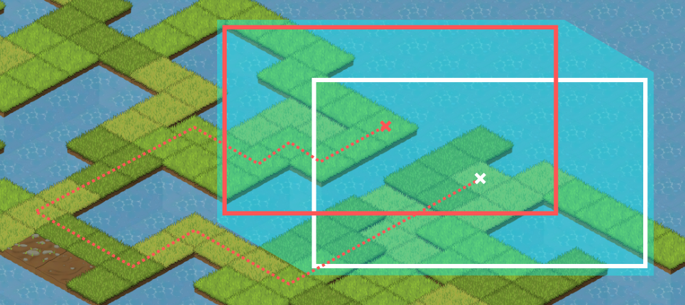

# Shared elements

## Introduction

### Persistence module

The persistence module stores all non-static information and changes dynamically depending on player's actions.

### Tile rendering

As I do not use Defold's built-in tile editor, I had to write my own routine for rendering tiles. Due to the large size of maps used within the exploration mode, rendering all the tiles at once would use up a significant amount of system resources. For example, a map with a size of 100 by 100 tiles would require the engine to store 30,000 sprites (each tile game object has three sprites associated with it - the terrain, object and a selection image). To optimize the performance, we have to render only tiles that are visible within the current camera view.

There are two programmatic approaches we can use to implement dynamic tile rendering. One is to remove game object instances that are no longer visible and add new instances. The other is to keep the existing game objects and move them from their original position to the new position. The practice of reusing intialised objects is called object pooling. It is used to mitigate performance issues when dealing with objects whose initialisation and destruction routines are resource intensive. Defold already has object pooling implemented on an engine level and the documentation specifically advises developers to use the earlier approach.

The developer can also decide on whether to complete the entire operation at once or whether to divide the process into steps that line up with character movement.

While trying both approaches, I have come across a large difference in performance, although on further inspection I found out it was due to lack of optimization on my part. I used to unnecessarily iterate through structural metadata about tilesets while preparing every single tile. I managed to solve this issue by creating a Lua table that stores tileset data about every used tile style.


## Architecture

### Data structures

The following section includes details on structures of persistent files used throughout the entirety of the game. Both the map files and the persistence module are stored inside files containing Lua tables. The Level data structure is stored in a JSON file.

#### Persistence module

The persistence module acts as a save file. It contains data on player's success rate for each kanji phrase, entries on active and completed quests, current NPC dialogs, items located in player's inventory, their level and experience points, which determine the size of the kanji selection pool.

#### Map

Maps are stored in a Lua script file. Tiled export formats also include JSON and CSV, however the choice of a Lua file including a table definition is preferable as it allows the load routine to skip deserialization, which can be advantageous when using larger map files. For a brief summary of contents, please refer to the Technology section of this thesis. As of version 0.17 Tiled also supports Defold's native tile format, however the current implementation only allows for orthogonal maps and is therefore unsuitable for my game.

The game uses four map layers to store data:

1. large_object - contains sprites spanning multiple tiles (e.g. trees)
2. object - contains smaller obstacles such as rocks or tile decorations
3. logic - used by the battle logic script to determine whether a cell is accessible
4. terrain - contains base tiles

#### Level

The file contains information on player levels and query phrases associated with them. Levels have an experience value associated with them. When a player gains a specified amount of experience, they reach a new level and unlock a new kanji character. This process widens the number of possible queries by adding phrases that contain the character. The 'basic' and 'complex' fields indicate the last phrase that can be shown to the player of that particular level. They correspond to the first and second arrays of the Dictionary data structure. Information on kun'yomi and on'yomi readings are also included for the Encyclopedia GUI to make use of.

```JSON
[
    {
        "kanji": "日",
        "kun": "ひ",
        "on": "にち",
        "basic": 1,
        "complex": 0,
        "experience": 100
    },
    ...
]
```

### Script entities

The following section contains information about script entities used in both the battle and exploration part of the game.

#### Map

Renders terrain tiles, objects and characters in a correct order based on information included within the map data structure as well as parameters passed from outside scripts.

The script also handles conversion between input coordinates and the game's coordinate system. Map coordinates are calculated using the following transformation matrix.


#### Camera

Moves the camera game object in a smooth fashion using linear interpolation with variable speed. I have decided on keeping the camera permanently locked on the player character's location. Originally, the camera moved to the target location in a straight line, but doing so presents a problem in specific environments, such as the one pictured below. If player were to move between the two points pictured, the player character would move off-screen, stay invisible for a couple seconds and then re-appear, which could confuse the player.


