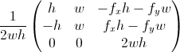

# Shared elements

## Introduction

### Persistence module

### Tile rendering

## Architecture

**INSERT DIAGRAM**

### Data structures

The following section includes details on structures of persistent files used throughout the battle part of the game. With the sole exception of map files, all files are in human-readable JSON format.

#### Map

Maps are stored in a Lua script file. Tiled export formats also include JSON and CSV, however the choice of a Lua file including a table definition is preferable as it allows the load routine to skip deserialization, which can be advantageous when using larger map files. For a brief summary of contents, please refer to the Technology section of this thesis. As of version 0.17 Tiled also supports Defold's native tile format, however the current implementation only allows for orthogonal maps and is therefore unsuitable for my game.

The game uses four map layers to store data:

1. large_object - contains sprites spanning multiple tiles (e.g. trees)
2. object - contains smaller obstacles such as rocks or tile decorations
3. logic - used by the battle logic script to determine whether a cell is accessible
4. terrain - contains base tiles

### Script entities

The following section contains information about script entities used in both the battle and exploration part of the game.

#### Map

Renders terrain tiles, objects and characters in a correct order based on information included within the map data structure as well as parameters passed from outside scripts.

The script also handles conversion between input coordinates and the game's coordinate system. Map coordinates are calculated using the following transformation matrix.

#### Camera

Moves the camera game object in a smooth fashion using linear interpolation with variable speed.
