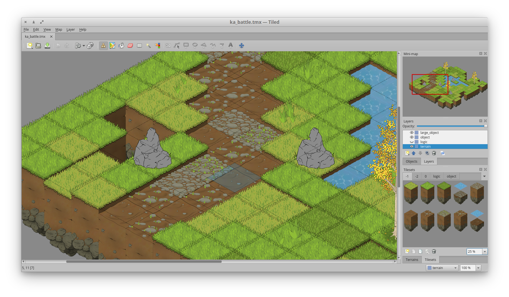

# Technology used

This chapter includes tools utilised during development of the game and discusses motivations behind choosing individual parts of the development stack.

## Defold

Going into development, I had three basic requirements for the programming tool used in the process. First, it has to support all major desktop and mobile platforms in order to satisfy the supportability requirements.


The other two requirements have been set in order to attempt to hasten the development process as creating a fully functioning prototype of an educational RPG by one programmer in approximately four months of time is a rather idealistic goal, especially for someone with no prior game programming experience. These are choosing a tool that includes an intuitive IDE with a fast learning curve as opposed to a bare bones library and one that is geared specifically towards creating 2D games in order to reduce the need for performance optimization.

Engine | License | Cost | Targets | Focus | Language
-- | - | - | - | - | - | -- | -- | --
Construct 2 | Proprietary | $129.99 ($429.99) | Mobile, (PC, web, Wii U) | 2D games | N/A (JavaScript)
Defold | Proprietary | free | PC, mobile, web | 2D games | Lua
Superpowers | ISC (GNU GPL compatible)| free | PC, mobile, web | 2D+3D games | TypeScript
Unity | Proprietary | $0 - $125/mo. | PC, mobile, web, consoles | 2D+3D games | C#, UnityScript, Boo

[Development in Construct 2 is done primarily using a visual event-driven design system. JavaScript is provided as an option.]

I have chosen Defold as the development platform as it allows for targeting all required platforms - Windows, macOS, Linux, iOS and Android, features a message-driven architecture that is very easy to comprehend and build around, has an active community and as of early 2017, a brand new IDE. It is also geared towards 2D development, although including 3D assets is possible with slight tweaking of the render script. Defold uses Lua, a lightweight dynamically typed programming language, often used in game development. Defold is also free to use and carries with it no publishing or royalty fees.

The basic building block used in Defold is called a game object. Game objects can include scripts that control their behaviour, sprites controlling their visual appearance, factories that can be configured to create other game objects and a variety of other components.

Game objects are grouped inside collections, which typically correspond to scenes used within the game (e.g. menu, battle, exploration). Communication between objects is handled through a built-in message passing system. Thanks to this system, the programmer seldom has to use the update loop.


The following is an excerpt from code showcasing the messaging system in action. The target of our message is the 'map controller' game object located inside the 'battle' collection. The portion behind the hash character is the component we want to address, in this case a script. The message title is given as the second argument, the third optional argument contains a Lua table that includes variables passed a part of the message.

```Lua
msg.post("battle:/map_controller#script","attack_enemy",
         {enemy_number = enemy_num, direction = direction})

```

On the receiving end, all we have to do is to add a construct inside the preset on_message function that resolves the message.

```Lua
function on_message(self, message_id, m, sender)
  if message_id == hash("attack_enemy") then
    if m.direction == "N" then
      msg.post(self.enemies[m.enemy_number],
               "play_animation", {id = hash("back_attack")})
...

```

## Tiled Map Editor

As of April 2017 Defold does not include native support for non-orthogonal tilemaps. Fortunately, there is a number of platform-agnostic map editors available including Tiled, an open-source offering in active development since 2008. It is by far the most popular choice with 2D game creators. I have chosen this software because it enables creation of isometric tilemaps, a deliberate design choice for my game.



The output file includes tile definitions (pairings of image file and its size with a unique tile id) which are grouped in tilesets, each containing information about offsets and the draw sizes of tiles contained within.

The second part of the output structure includes layer definitions. Each layer has a size, offset from origin and a serialized array which contains placed tiles.

Please keep in mind that the aforementioned contents are in no way an exhaustive listing of data included in the output file.

## Data storage

There are two commonly used ways to work with external data sources in Defold, one is to use a Lua table and the other is to utilise the built-in JSON library. The developer is free to implement support for other file types using a Lua library or the C++-based native extension system. As of April 2017 there is no native support for any database engine. One possible workaround could be to run a server-side database with an API endpoint and use Defold's HTTP library, though this process is highly impractical.

### JSON

I have chosen JSON as the format of choice for storing most of my data structures due to its easy readability, standardization and built-in support in Defold. The size of data I store is not as large as to warrant using a database. Defold supports deserialization of JSON files into Lua tables, however the reverse process is not possible.

### Lua table

The engine allows for serialization and deserialization of tables, a basic Lua data structure. Lua tables are not as human readable as JSON, therefore I only use them with map files generated by Tiled, which includes Lua support, and save files containing player statistics. In contrast with JSON, Lua tables can be serialized and saved to an external file using built-in library functions.

## Git

Git has been chosen as the version control system for this project due to its integration into Defold's user interface and my general familiarity with the tool, though it is hardly practical for larger projects.

One issue game developers might encounter while using Git are impracticalities stemming from versioning a large number of sizable binary files that make up the game's assets. The internal '.git' folder can reach large sizes and fetching changes from remote locations can take longer than necessary. Public hosting sites such as GitHub, GitLab and Bitbucket also enforce a size limit on repositories hosted on their sites.

There are two solutions to this problem. One is to use a different VCS such as Subversion, which is better suited to dealing with binary files. The other is to utilise what's known as Git Large File Storage, an open-source tool which replaces large files with pointers to a remote location.
