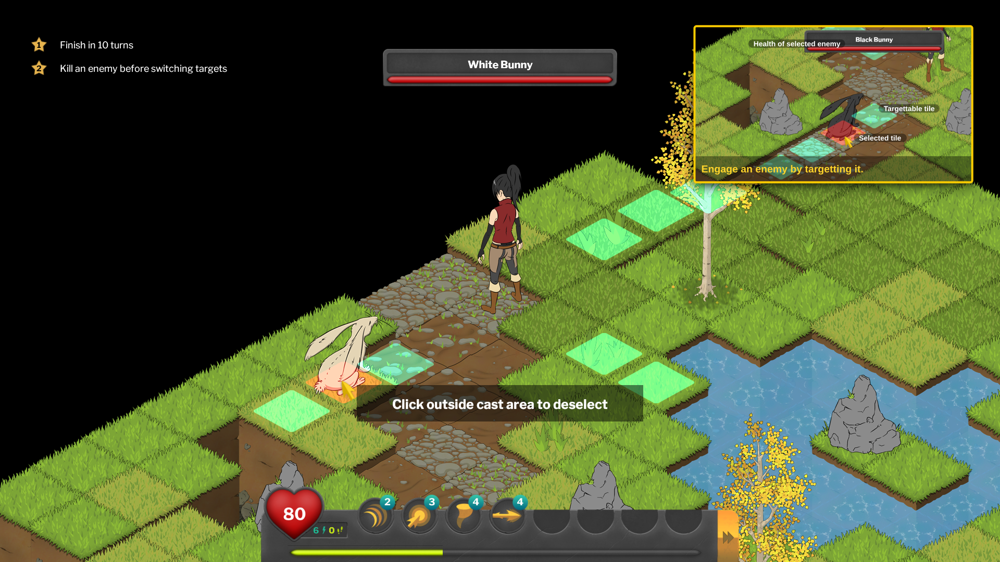

# Tutorial

This section details the process of introducing the player to key gameplay mechanics via a series of images that guide the player to perform specific actions. This approach was chosen for its ability to immerse the player into the game. We wanted to avoid using complex pop-up dialogues as they detract from the experience. The comparatively small window on top right can be easily ignored if wanted to.

# Steps

## Exploration mode (first part)
The tutorial begins immediately after starting a new game.

- The first picture shows the player how to open the kanji encyclopedia GUI.

- After opening the panel they are presented with their first kanji character and told they have to remember the furigana as it will be used in their first battle.

- On closing the dialogue, the player receives a hint on how to move in the exploration mode.

- When the player moves to another tile, they are told to talk to a nearby NPC who will offer them their first quest.

- After accepting the quest the player is then guided to open up the quest GUI.

- A brief explanation of quest types and objectives follows.

- After closing the dialogue, the player is told to attack their first enemy, which is incidentally an objective of their first quest.

## Battle mode

- Upon entering the battle mode, the player is given instructions on movement.

- After moving one or more tiles, the player is told about spells and core battle mechanics (movement and action points). They are then told to activate a spell.

- After clicking on a spell icon, the player is instructed to choose a target.

- Afterwards a query interface appears and the player is given an explanation about query-specific GUI elements.

- Upon answering the query, the player is told to end their turn.

- After clicking on the end turn button, the player is instructed to finish the battle by defeating all enemies.

## Exploration mode (second part)

- After the player emerges victorious in their first battle, they are given instructions on how to finish their quest.

- Once they turn in the quest, they are given an explanation of quest rewards after which they are told to open up the inventory GUI.

- Afterwards the differences between item types is explained and the player is told to use their reward item, which is a piece of equipment.

- After equipping the article of clothing, they are told about a follow-up quest, which concerns battle challenges.

- An explanation of the challenges system follows.

Upon completion of a single challenge, the tutorial ends.
